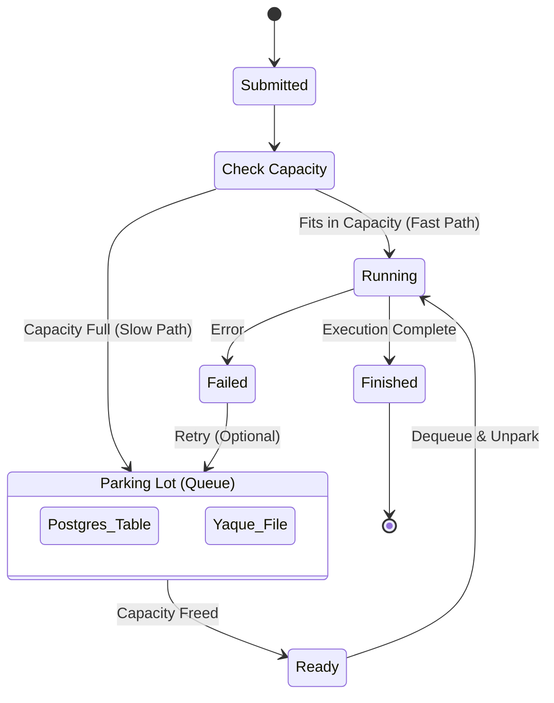

This analysis breaks down the **Parking Lot Algorithm** from its theoretical roots in concurrency control to its practical application in distributed systems, specifically tailored for your `prometheus_parking_lot` crate.

### **Part 1: Analysis of the Parking Lot Algorithm**

The "Parking Lot" is a synchronization pattern designed to manage contention for shared resources. Unlike simple busy-waiting (spinning) or immediate OS-level blocking, it employs a hybrid strategy to balance CPU efficiency and latency.

#### **1. Core Concept: The Three States**

At its heart, the algorithm models resource acquisition as a state machine with three potential outcomes for a requesting thread/task:

1. **Fast Path (Acquired):** The resource (e.g., Mutex, Semaphore, or GPU slot) is free. The thread claims it via an atomic operation (CAS) and proceeds immediately.
2. **Adaptive Spin (Waiting):** The resource is busy, but might be free *soon*. Instead of sleeping immediately, the thread spins in a loop for a few microseconds. This avoids the expensive context switch overhead (approx. 5-10µs) if the lock holder releases it quickly.
3. **Park (Blocked):** If spinning fails, the thread "parks" itself. It records its identity in a queue (the "parking lot") and yields the CPU. It effectively sleeps until explicitly "unparked" by a resource holder.

#### **2. Variations & Tuning**

| **Variation**                 | **Mechanism**                                                | **Best For**                                   | **Trade-offs**                                               |
| ----------------------------- | ------------------------------------------------------------ | ---------------------------------------------- | ------------------------------------------------------------ |
| **Adaptive Spinning**         | Threads spin based on a heuristic (e.g., avg lock hold time). If the owner is running, spin; if sleeping, park immediately. | Low-latency systems (e.g., trading, databases) | Burns CPU cycles if the heuristic is wrong.                  |
| **Thundering Herd Avoidance** | When a resource frees up, only *one* thread is unparked.     | High-contention locks                          | Prevents "storm" of threads waking up to fight for one slot, reducing context switching. |
| **Fairness (FIFO)**           | The parking lot is a strict FIFO queue. Newcomers cannot steal the lock even if it's momentarily free. | Starvation prevention                          | Lower throughput because the "handoff" is slower than a hot thread grabbing the lock. |
| **Direct Handoff**            | The releaser directly transfers ownership to the unparked thread without releasing the lock globally. | Extreme contention                             | Guarantees progress for the waiter but prevents "lock stealing" optimizations. |

#### **3. Rust Implementation (`parking_lot` crate)**

The Rust `parking_lot` crate improves on standard system mutexes by moving the queueing logic to **user space**.

- **Global Hashtable:** Instead of a kernel object per mutex, it uses a global hashtable keyed by the memory address of the lock. This makes the Mutex struct itself tiny (1 byte), fitting easily into CPU caches.
- **Adaptive Strategy:** It spins slightly on contention before offloading the thread to the global parking lot.

------

### **Part 2: Applying this to `prometheus_parking_lot`**

Your crate, `prometheus_parking_lot`, elevates this low-level concurrency pattern to a **distributed architectural pattern**.

1. **The "Resource" is Macro:** Instead of a CPU register or memory address, your resources are **GPU VRAM** or **Worker Slots**.
2. **The "Spin" is Virtual:** We don't busy-wait the CPU. Instead, we might "spin" effectively by keeping a request in an in-memory buffer for a few milliseconds before committing it to the persistent DB queue (optimization for bursty traffic).
3. **The "Parking Lot" is Durable:** Your "Global Hashtable" is replaced by **Postgres/Yaque**. A task "parking" means it is serialized to disk. "Unparking" is the Scheduler waking up and pulling the next job.

------

### **Part 3: The `PARKING_LOT.md` Artifact**

Here is the formal design document relating these algorithmic concepts to your specific implementation.

Markdown

```
# PARKING_LOT.md: Algorithm & Design Specification

## 1. Introduction

The **Prometheus Parking Lot** is a distributed, persistent implementation of the classic "Parking Lot" concurrency pattern. While traditional mutexes manage access to CPU cycles, this system manages access to **macro-resources** (GPU VRAM, LLM Context Windows, API Rate Limits) across distributed agents.

This document defines the algorithmic behavior, the state machine, and the specific variations used to ensure fairness, durability, and throughput.

## 2. The Core Algorithm

The system treats the entire agent cluster as a single synchronized domain. It uses a **Two-Tier Scheduling** approach analogous to *Adaptive Spinning* in low-level locks.

### 2.1 The "Park-or-Run" Logic

When a client submits a `ScheduledTask`:

1.  **Fast Path (Run):**
    * **Check:** Is `active_units + task_cost <= max_capacity`?
    * **Action:** If yes, the task is **executed immediately**. The "lock" (capacity) is acquired without touching the persistent queue.
    * **Latency:** Microseconds (In-Memory).

2.  **Slow Path (Park):**
    * **Check:** Capacity is full.
    * **Action:** The task is **Parked**.
        * It is serialized.
        * It is written to the **Backing Store** (Postgres/Yaque).
        * The client receives a `Ticket` (TaskId) instead of a result.
    * **Latency:** Milliseconds (I/O bound).

3.  **Unpark (Wake):**
    * **Trigger:** A running task completes (`active_units` decreases).
    * **Action:** The Scheduler scans the "Parking Lot" (Queue).
    * **Selection:** It picks the highest-priority, oldest task that *fits* the new available capacity.

### 2.2 Visual State Machine




## 3. Algorithmic Variations

We employ specific variations of the standard algorithm to suit AI workloads.

### 3.1 Priority-Aware Ordering (The "VIP" Lane)

Unlike a standard Mutex which is often FIFO, AI workloads require priority.

- **Standard:** First-In-First-Out (FIFO).
- **Prometheus Implementation:** `Priority > CreationTime`.
  - *Why:* A "Critical" health-check agent must bypass 500 "Low" priority batch summarization jobs.

### 3.2 Thundering Herd Avoidance

When a large task (e.g., 24GB VRAM training job) finishes, it frees up a massive amount of capacity.

- **Risk:** Waking up 100 small tasks simultaneously to race for the slot.
- **Prometheus Implementation:** The Scheduler is **Single-Writer** for capacity updates. It strictly calculates which jobs fit and "unparks" (dequeues) them one by one until capacity is filled again. There is no race condition because the Scheduler is the sole arbiter of the "Unpark" event.

### 3.3 Fairness vs. Throughput (Bin Packing)

- **Strict Fairness:** If the head of the queue is a large job (10GB) and we only have 4GB free, we wait. This causes resource idling.
- **Prometheus Implementation (Skip-Ahead):**
  - We use a **modified FIFO** approach.
  - If the head of the queue cannot run (insufficient VRAM), we **peek** at the next items.
  - Small jobs that *do* fit are "unparked" out of order to maximize GPU utilization (Bin Packing).
  - *Starvation Guard:* A large job gets a "starvation score" that eventually forces the system to drain completely to let it run.

## 4. Distributed Synchronization

In a distributed context (e.g., Cloud Gateway), multiple Scheduler instances might try to "unpark" jobs from the same Postgres table.

### 4.1 Optimistic Concurrency Control (OCC)

To prevent two nodes from picking up the same job:

1. **Select:** `SELECT * FROM queue WHERE status = 'parked' ORDER BY priority LIMIT 1`
2. **Claim:** `UPDATE queue SET status = 'running', owner = 'node_1' WHERE id = $ID AND status = 'parked'`
3. **Verify:** If the UPDATE affects 0 rows, another node "stole" the job. Retry.

- *Benefit:* Avoids heavy table locks, allowing high throughput.

## 5. Cost Model Integration

The standard Parking Lot algorithm counts "threads" (1 thread = 1 slot). We extend this to **Vectorized Resources**.

- **Standard Mutex:** `available = 1`
- **Semaphore:** `available = N`
- **Prometheus Cost Model:**
  - `available_vram = 24_000 (MB)`
  - `available_workers = 4`
  - **Constraint:** Task must satisfy `task.vram <= available_vram AND task.workers <= available_workers`.

This ensures that an Agent never crashes due to OOM, effectively "parking" the crash until resources exist to handle it safely.